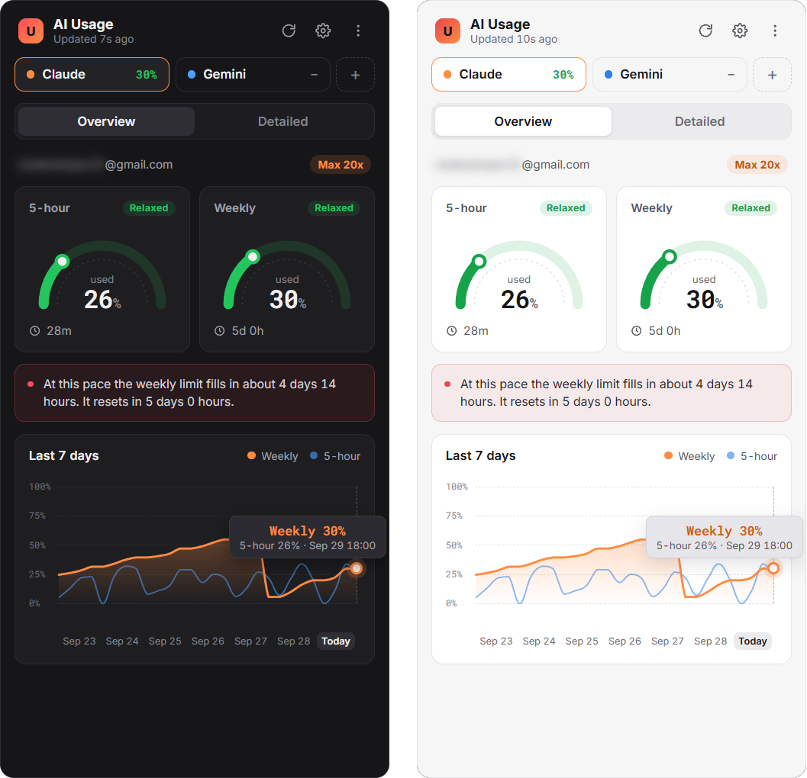
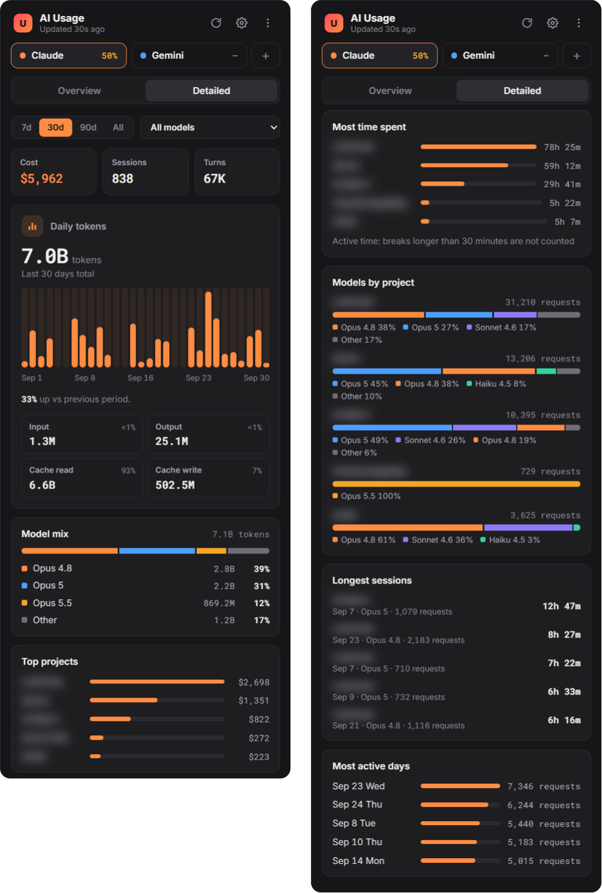

# AI Usage

A lightweight Windows system tray application that tracks your AI coding tool usage — Claude, Codex, Gemini and Cursor — in real time.

> Formerly **Claude Usage**. Renamed in 1.4.0 since it's no longer Claude-only; upgrading keeps your data (see [Installation](#installation)).


---

<p align="center">
  
</p>

<p align="center"><sub>Overview — dark and light themes</sub></p>

---

## Features

### Overview
- **Limit gauges** — Claude's 5-hour and weekly limits as arc gauges, with a status pill (Relaxed / Watch / Critical) and time until reset
- **Plan badge** — Your subscription plan (e.g. `Max 20x`) read from your Claude Code session
- **Weekly projection** — Estimates where the weekly limit will land at reset, or how soon it fills up at your current pace
- **Most used models** — Top model and request share per model over the last 7 days
- **7-day chart** — Weekly and 5-hour utilisation over the past week, with a hover tooltip
- **Provider tabs** — Switch between Claude and any detected provider; each tab shows its peak utilisation

### Detailed
- **7 / 30 / 90-day or all-time periods** and a **model filter**
- **KPIs** — Estimated cost, sessions and turns for the period
- **Daily token bars** — Hover for a single day; change vs the previous period
- **Token types** — Input, output, cache read and cache write amounts
- **Model mix** — Token share per model
- **Top projects** — Ranked by estimated cost
- **Time per project**, **models used in each project**, **longest sessions** and **most active days** — durations are active time (breaks over 30 minutes are not counted)

<p align="center">
  
</p>

<p align="center"><sub>Detailed view (last 30 days) — project names blurred</sub></p>

### Multi-Provider (Local Scan)
- **Codex** — Scans OpenAI Codex CLI rollout logs from `~/.codex/sessions/`; 5-hour and weekly limits come from the rate-limit snapshot in the newest session
- **Gemini** — Scans Google Gemini CLI chat sessions from `~/.gemini/tmp/`
- **Cursor** — Reads chats from Cursor's `state.vscdb` in `%APPDATA%\Cursor\User` (undocumented format; some Cursor versions don't record token counts)
- Providers without a limit API show their local token usage instead of gauges

### App
- **System tray app** — Runs quietly in the tray; click the icon to view, click away to hide
- **Dark & light themes** — System (follows Windows live), Light or Dark
- **Turkish / English** interface
- **Limit alerts** — Desktop notification when a limit passes 80%
- **Configurable refresh** — Every 1, 5 or 15 minutes
- **Launch at startup** — Optional auto-start with Windows
- **Rate-limit friendly** — Usage responses are cached; when the API rate limits, the last known data is shown
- **Works offline** — Fonts and charts are bundled; the UI loads nothing from the network

---

## Installation

### Requirements

- Windows 10 / 11
- [Claude Code](https://claude.com/claude-code) signed in (`claude login`) — the app reads Claude Code's session, no separate sign-in

### Download & Install (Recommended)

1. Download the latest **`AI Usage Setup x.y.z.exe`** from the [Releases](../../releases) page
2. Run the installer — it will install and launch automatically
3. Look for the icon in your **system tray** (bottom-right of your taskbar)

> No admin rights required. The app installs to your user profile.
>
> **Upgrading from Claude Usage (1.3.x or older):** quit the running app from the tray (**right-click → Quit**), then install. The installer replaces the old app, and on first start AI Usage copies your history, settings and preferences from `%APPDATA%\claude-usage-app` (the old folder is left in place) and keeps *Launch at Windows startup* on if it was.

### Build from Source

```bash
# Clone the repository
git clone https://github.com/kad1r/ai-usage.git
cd ai-usage

# Install dependencies
npm install

# Rebuild native modules for Electron
npx electron-rebuild

# Run in development mode
npm start

# Run the tests (uses Electron's Node, like the app)
npm test

# Build the installer
npm run build
```

The installer will be generated at `dist/AI Usage Setup <version>.exe`.

---

## Usage

1. Make sure Claude Code is signed in (`claude login`)
2. **Click the tray icon** to open the window — your usage appears with live data

Other providers (Codex, Gemini, Cursor) are detected automatically from local files — no sign-in required.

### Controls

| Control | Location | Description |
|---------|----------|-------------|
| Refresh | Top-right ↻ | Refresh usage data now |
| Settings | Top-right ⚙ (or `+` next to the provider tabs) | Providers, theme, language, refresh interval, limit alert, launch at startup |
| Menu | Top-right ⋮ | Settings / Quit app |
| Provider tabs | Below the header | Switch provider |
| Overview / Detailed | Below the provider tabs | Switch view |
| `Ctrl+Q` | Anywhere | Quit the app |

### Tray Icon

- **Left-click** — Toggle the window
- **Right-click** — Context menu (Show / Quit)

---

## How It Works

### Claude
Reads the OAuth session that Claude Code stores in `~/.claude/.credentials.json` and queries the Anthropic usage endpoint for your 5-hour and weekly limits. The usage endpoint is rate limited per session (shared with Claude Code itself), so responses are cached for 2 minutes and `Retry-After` is honoured — while rate limited the app keeps showing the last known data.

### Local usage (all providers)
Scans local session logs written by each tool (Claude Code's `~/.claude/projects/`, Codex, Gemini, Cursor) every 5 minutes in a background utility process, so the tray and window stay responsive. Claude transcripts are read incrementally (only the bytes added since the last scan). No network requests — all data stays on your machine. A SQLite database stores the parsed sessions for the Detailed view; costs are estimates based on published token prices.

### Data Displayed

| Metric | Description |
|--------|-------------|
| **5-hour / Weekly** | Claude limit utilisation in the current window, with time until reset |
| **Projection** | Where the weekly limit will be at reset at your current pace |
| **7-day chart** | Weekly and 5-hour utilisation history recorded by the app |
| **Cost** | Estimated cost based on published token prices |
| **Sessions / Turns** | Number of sessions and request/response pairs |
| **Tokens** | Input, output and cache tokens per day and per model |

### Status Colours

| Utilisation | Status |
|-------------|--------|
| 0–49% | Green — Relaxed |
| 50–79% | Amber — Watch |
| 80–100% | Red — Critical |

---

## Project Structure

```
ai-usage/
├── main.js              # Electron main process (tray, IPC, usage cache, history)
├── scan-worker.js       # Utility process that runs the local scanners
├── db.js                # SQLite schema and migrations
├── stats.js             # Detailed view queries
├── preload.js           # Secure IPC bridge between main and renderer
├── renderer.js          # UI: views, SVG charts, settings, i18n, themes
├── index.html           # Application markup
├── styles.css           # Styling, dark/light theme tokens
├── fonts/               # Bundled Inter and Roboto Mono
├── icon.ico             # Application icon
├── package.json         # Dependencies and build configuration
├── test/                # node:test suites (npm test)
└── providers/
    ├── registry.js      # Provider registry singleton
    ├── base.js          # BaseProvider abstract class
    ├── pricing.js       # Token prices for Claude, OpenAI and Gemini models
    ├── claude/          # Claude provider + session scanner
    ├── codex/           # OpenAI Codex CLI scanner
    ├── gemini/          # Google Gemini CLI scanner
    └── cursor/          # Cursor scanner
```

### Technical Details

- **Framework:** Electron 41, plain JavaScript, charts as inline SVG
- **Auth:** Uses Claude Code's existing session — the app stores no Claude credentials of its own
- **API:** Anthropic usage endpoint (`api.anthropic.com`)
- **Local storage:**
  - `%APPDATA%\ai-usage\data\usage.db` — Parsed session data from all providers (SQLite, `better-sqlite3`); copied once from `~/.claude/usage.db` when upgrading from 1.4 or older
  - `%APPDATA%\ai-usage\data\history.json` — Utilisation data points (last 30 days)
  - `%APPDATA%\ai-usage\data\usage-cache.json` — Last usage response
- **Reliability:** Atomic JSON writes, unreadable history is kept aside as `history.corrupt-<timestamp>.json`, single-instance lock
- **Security:** Context isolation, sandboxed renderer, no `nodeIntegration`, navigation and new windows blocked, strict Content Security Policy (no remote scripts or fonts)
- **Build:** electron-builder with NSIS installer, `asarUnpack` for the native SQLite module

---

## Troubleshooting

| Problem | Solution |
|---------|----------|
| App doesn't appear | Check the system tray (click the **^** arrow in the taskbar to see hidden icons) |
| "Claude Code session not found" | Run `claude login` in a terminal, then reopen the app |
| Session expired | Run `claude login` again — the app follows Claude Code's session |
| "Updated … ago · cached" in the header | The usage API is rate limiting; the app shows the last known data and retries automatically |
| Tray icon missing after restart | Enable **Launch at Windows startup** in Settings |
| Gemini/Codex shows no data | Ensure you have used the respective CLI tool and sessions exist in `~/.gemini/` or `~/.codex/` |

---

## Contributing

1. Fork the repository
2. Create your feature branch (`git checkout -b feature/my-feature`)
3. Commit your changes (`git commit -m 'Add my feature'`)
4. Push to the branch (`git push origin feature/my-feature`)
5. Open a Pull Request

---

## License

MIT — see [LICENSE](LICENSE).
